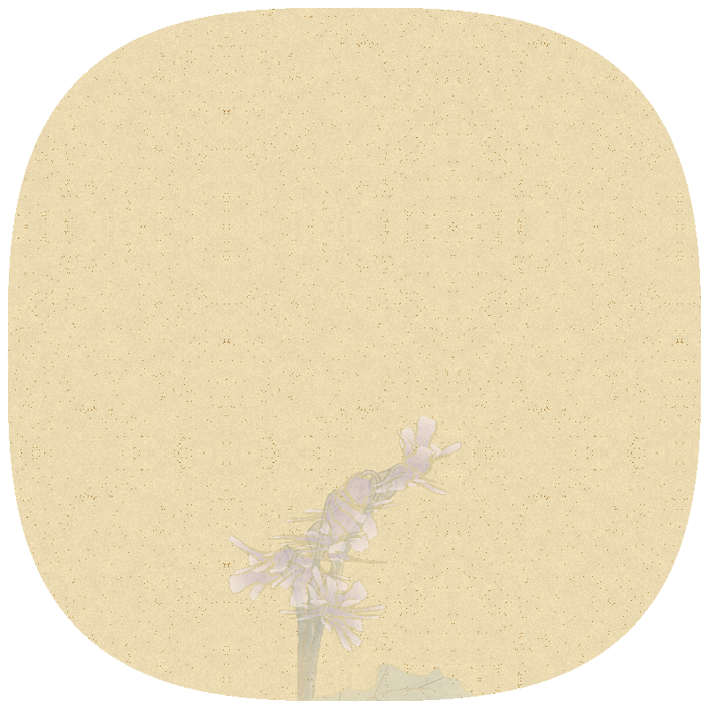

# Nonflowers CLI

Procedurally generated paintings of nonexistent flowers in Gongbi style, available as a command-line tool.



This project is a Python reimplementation of [Lingdong Huang's original Nonflowers](https://github.com/LingDong-/nonflowers) web-based generator, offering a powerful command-line interface with extensive customization options.

## What is this?

Nonflowers CLI generates procedural, algorithmically-created flowers that don't exist in nature, rendered in a style inspired by traditional Chinese Gongbi (工筆) painting. Each generated image features:

- Procedurally generated plant structures (stems, branches, leaves)
- Algorithmically created flower shapes and patterns
- Paper-like textures and ink effects
- Realistic color variations and shading

Every generation is unique, controlled by a random seed that can be specified for reproducible results.

## Installation

### Prerequisites

- Python 3.6 or higher
- Pillow library

### Install from GitHub

```bash
# Clone the repository
git clone https://github.com/MushroomFleet/nonflowers-cli.git
cd nonflowers-cli

# Install dependencies
pip install pillow
```

## How to Use

### Basic Usage

Generate a random flower with default settings:

```bash
python nonflowers.py
```

This will create an image in the `output/` directory with a timestamp and random seed in the filename.

### Specifying Output

```bash
python nonflowers.py --output my_flower.png
```

### Controlling Plant Type

Generate either woody (tree-like) or herbal (stem-like) plants:

```bash
python nonflowers.py --type woody
python nonflowers.py --type herbal
```

### Using a Specific Seed

For reproducible results, specify a seed:

```bash
python nonflowers.py --seed 12345
```

### Customizing Dimensions

```bash
python nonflowers.py --width 1200 --height 1600
```

## Advanced Options

Nonflowers CLI provides extensive customization options, allowing control over nearly every aspect of the generated plants:

### Controlling Plant Structure

```bash
# Customize stem properties
python nonflowers.py --stemCount 3 --stemLength 400 --stemWidth 10 --stemBend 8

# Customize branch properties (for woody plants)
python nonflowers.py --type woody --branchDepth 4 --branchFork 5 --branchWidth 1.2
```

### Controlling Leaves and Flowers

```bash
# Adjust leaf properties
python nonflowers.py --leafChance 0.15 --leafLength 80 --leafWidth 25

# Adjust flower properties
python nonflowers.py --flowerChance 0.2 --flowerLength 40 --flowerWidth 20 --flowerPetal 6
```

### Herbal Plant Specific Options

```bash
# Customize sheath and shoot properties
python nonflowers.py --type herbal --sheathLength 60 --sheathWidth 10 --shootCount 4 --shootLength 150
```

## Complete Options List

```
Basic parameters:
  --seed SEED          Random seed for generation
  --width WIDTH        Image width (default: 600)
  --height HEIGHT      Image height (default: 800)
  --output OUTPUT      Output file path (default: output/nonflower_[timestamp]_[seed].png)
  --type {woody,herbal,random}
                       Plant type to generate (default: random)

Plant parameters:
  --stemCount STEMCOUNT
                       Number of stems
  --stemLength STEMLENGTH
                       Length of stems
  --stemWidth STEMWIDTH
                       Width of stems
  --stemBend STEMBEND  Amount of stem bending
  --leafChance LEAFCHANCE
                       Chance of leaf generation (0-1)
  --flowerChance FLOWERCHANCE
                       Chance of flower generation (0-1)
  --leafLength LEAFLENGTH
                       Length of leaves
  --leafWidth LEAFWIDTH
                       Width of leaves
  --flowerLength FLOWERLENGTH
                       Length of flower petals
  --flowerWidth FLOWERWIDTH
                       Width of flower petals
  --flowerPetal FLOWERPETAL
                       Number of flower petals
  --branchDepth BRANCHDEPTH
                       Depth of branch recursion (woody plants)
  --branchFork BRANCHFORK
                       Number of branches that fork (woody plants)
  --branchWidth BRANCHWIDTH
                       Width of branches (woody plants)
  --sheathLength SHEATHLENGTH
                       Length of sheaths (herbal plants)
  --sheathWidth SHEATHWIDTH
                       Width of sheaths (herbal plants)
  --shootCount SHOOTCOUNT
                       Number of shoots (herbal plants)
  --shootLength SHOOTLENGTH
                       Length of shoots (herbal plants)
  --leafPosition {1,2}
                       Leaf positioning pattern (1 or 2)
```

## Examples

### Example 1: Simple Flowering Tree

```bash
python nonflowers.py --type woody --flowerChance 0.1 --leafChance 0.2 --width 800 --height 1000
```

### Example 2: Detailed Herbal Plant

```bash
python nonflowers.py --type herbal --stemCount 4 --flowerChance 0.3 --flowerPetal 12 --leafPosition 2
```

### Example 3: Minimal Woody Plant with Few Flowers

```bash
python nonflowers.py --type woody --stemCount 2 --branchDepth 2 --flowerChance 0.05 --leafChance 0.1
```

### Example 4: High Resolution Export

```bash
python nonflowers.py --width 2000 --height 3000 --output high_res_nonflower.png
```

## License

[MIT License](LICENSE)

## Acknowledgements

This project is a Python reimplementation of [Lingdong Huang's original Nonflowers](https://github.com/LingDong-/nonflowers) project. The core algorithms and artistic approach are based on their work.
